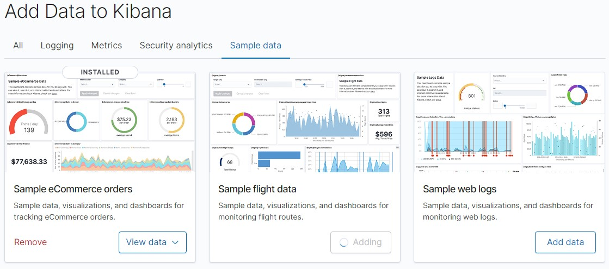
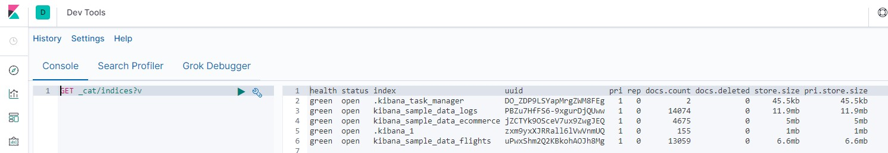

# Importing Sample Data

>  :warning: :warning: :warning: IMPORTANT NOTE: It is assumed you have a working kibana node to work from the "development console" and that you have imported the sample data.

> See: [Running test servers on docker](Test_servers_on_docker.md)

https://www.elastic.co/guide/en/kibana/7.12/get-started.html#gs-get-data-into-kibana

v7.2 https://www.elastic.co/guide/en/kibana/7.2/getting-started.html#get-data-in

The sample data is required to complete the exercises in these notes.

## Click on Try our sample data


## Add all sample datasets


## Using the Dev Console, show the indicies



Run: `GET _cat/indices?v`

```
health status index                        uuid                   pri rep docs.count docs.deleted store.size pri.store.size
green  open   .kibana_task_manager         DO_ZDP9LSYapMrgZWM8FEg   1   0          2            0     45.5kb         45.5kb
green  open   kibana_sample_data_logs      PBZu7HfFS6-9xgurDjQUww   1   0      14074            0     11.9mb         11.9mb
green  open   kibana_sample_data_ecommerce jZCTYk9OSceV7ux9ZwgJEQ   1   0       4675            0        5mb            5mb
green  open   .kibana_1                    zxm9yxXJRRall6lVwVnmUQ   1   0        155            0        1mb            1mb
green  open   kibana_sample_data_flights   uPwxShm2Q2KBkohAOJh8Mg   1   0      13059            0      6.6mb          6.6mb
```
